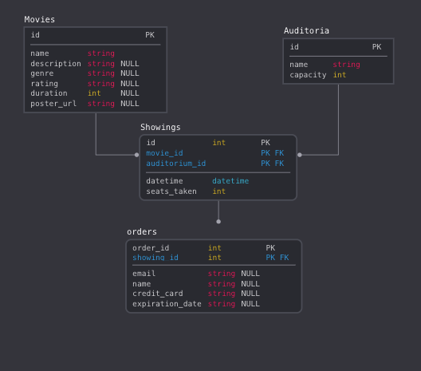

# README

# Usage

Clone the project and run the usual rails commands. There shouldn't be anything out of the ordinary that would prevent this app from running normally in a dev environment. The Mailer is set to only send emails on production, so setting those environmental variables isn't necessary.

The app uses PG in development and production.

run ``` rake db:seed ``` to populate the DB with seed data.

# DB Modeling

A basic diagram of the database:



## Relationships

Movies: 
* Has many relationship with showings
* Has many relationship with auditoria through showings

Auditoria:
* Has many showings
* Has many movies through showings

Showings
* Belongs to movie
* Belongs to auditorium
* Has many orders

Orders
* Belongs to showing

These relationships are clear and straight forward and allows us to work with the tables in a way that makes sense while satisfying the requirements of the project.
One thing to note is the inclusion of seats_taken in the showings table, this value could be calculated as a virtual attribute based on a showing's order and the linked auditorium capacity, however I determined that, for performance reasons, it is better to have it as a column in my table. The reasoning behind that is that, as per the requirements, the movie index will display only movies that have available showings, that is: It it a showing that has not expired and it has not sold out, querying the movies -> showings -> (auditoria, orders) tables every time users visit the homepage or a movie show page could impact the performance of the application if we're dealing with a large quantity of users simultaneously, the seats_taken field mitigates this due to it being updated when a purchase has been made, reducing the tables queried from four to only movies -> showings -> auditoria.

Some models have scopes and/or virtual attributes that facilitate the handling of data within the application.
Showings for example has a scope that returns showings that have not been sold out and those that are playing now (are scheduled for a date in the future). It also has sold_out? and playing_now? virtual attributes.

Another example is order that has virtual attributes for the linked movie_name, date and time, and auditorium assigned, which simplify a lot the structure of our controllers and views when we need to display these values.

And lastly the movies table contains a note-worthy class method: movie_orders. This method allows us to easily map movies to all the orders, useful for the order administration page, where admins can view orders by movie, as was requested in the requirements.

## Validations

Aside from the usual "presence" and "uniqueness" validations where deemed necessary, there are a few validations of interest in the order model:

* The credit card validator, a custom validator that simply checks for the validity of the syntax and specially that the expiration date is valid, including the format, that the months field does not exceed "12" and of course that the card is not expired.

* The valid showing validator, included as a private method in the model, verifies that the showing that the user is trying to purchase hasn't expired and that it hasn't sold out, this validation is very important as it would prevent e.g two users purchasing the last spot for a showing, or a user modifying the param in the url to bypass the disabled links for sold out showings.

All validations show a respective user-friendly message whether is an user buying a ticket or an admin making changes to the app.

Speaking of which...

## Application administration

As requested in the requirements, admins need to manage auditoriums, movies playing, showings, and view orders. Since authentication wasn't required I decided to create a barebones SessionsController that allows the user to view the application as an Admin or as a regular user, using Rail's Session. This allows easy toggling between the two modes with a button in the navbar. 

Admins gain access to the auditorium manager, the movie creation page and the orders page through navbar links. Additionally they can view movies in the index that would otherwise not be shown to regular users because e.g there are no showings for it. Each movie's show page displays links to edit the movie, manage showings to it or delete it.

## Other thoughts

Things that I would like to add:

* Validate that the admin showing is valid, considering a movie duration, its date and the auditorium. i.e don't allow two showings in the same auditorium simultaneously.

* Clean up past orders or showings that are older than x days

* Better administration of showings, perhaps a central page to manage them all.


